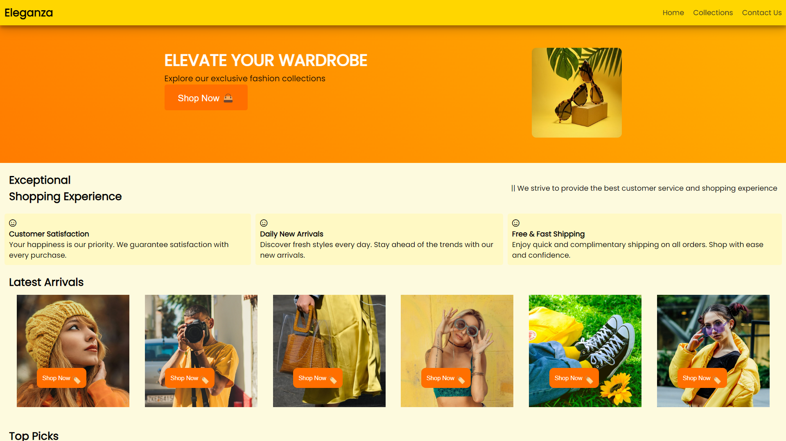

# Eleganza
**Development Team**: Rajasekar M

This project was developed solely by Rajasekar M.

## Project Overview
Eleganza is a vibrant and dynamic e-commerce website designed to offer a seamless and engaging shopping experience. The platform is optimized for both laptop and mobile devices, ensuring a consistent and high-quality user experience across different screen sizes.

## System Requirements
Before you begin, make sure you have the following installed on your system:
- A web browser (Chrome, Firefox, etc.)

## Project Features
- **Colorful and Intuitive Design**: A visually appealing theme that enhances user experience.
- **Sticky Navbar with Smooth Transitions**: Effortlessly navigate through the site with a sleek and responsive navbar.
- **Animated Header**: Welcoming header design with fluid animations.
- **Responsive Video Content**: Engaging videos customized for both landscape and portrait modes with sound, tailored for laptop and mobile screens.
- **Diverse Collections with Smart Search**: Find your desired products quickly and easily.
- **Animated Popups**: Enjoy interactive and eye-catching notifications.
- **Email Verification for Subscriptions**: Stay updated with verified email checks for newsletter sign-ups.
- **Modern Footer Design**: An elegant footer that complements the overall aesthetic.
- **Engaging 'Contact Us' Section**: A lovable and user-friendly contact interface.
- **Social Media Integration**: Smoothly link to Instagram, GitHub, LinkedIn, and more.

## Running the Project
To view the project, simply visit the hosted website on GitHub:
[Eleganza](https://rajas1010.github.io/E-commerce/)

## Screenshots
Include some screenshots here to visually represent our project.

Homepage

Advertisement videos

contact page

### Mobile View

  
  
  

## Video
Include a video demonstrating the features and functionality of our project.
[Project Demo Video](path/to/video.mp4)

## Conclusion
Eleganza represents a culmination of thoughtful design and functional excellence, addressing various challenges to deliver a high-quality user experience. The project highlights the importance of responsive design and user-friendly interfaces in modern e-commerce websites. Feedback and suggestions are always welcome as I continue to refine and enhance this project.

## Summary
- **Project Name**: Eleganza
- **Description**: This e-commerce website offers a vibrant and dynamic shopping experience with a range of features including animated headers, responsive videos, smart search options, and more.
- **User Interface**: The project features a visually appealing and user-friendly design.
- **Technologies Used**: HTML, CSS, JavaScript
- **Optimization**: The site is optimized for both laptop and mobile devices.
- **Challenges**: Overcoming issues with image fetching and display on collection and product detail pages.
- **Usage**: Visit the GitHub link to explore the project.

This project aims to provide a delightful shopping experience through a well-designed and functional e-commerce platform.
